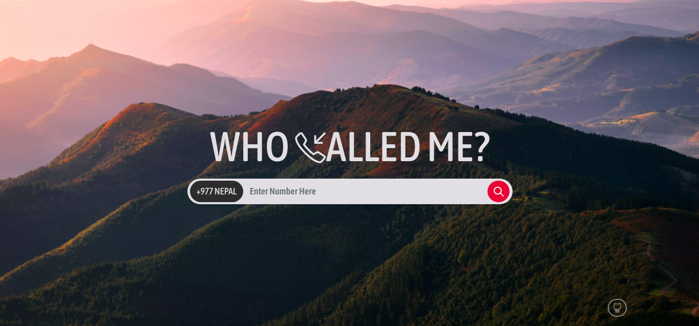

## Who Called Me? 
  

A flask app that checks whether the number is from Ncell, Namaste, UTL, SmartCell, HelloNepal or Landline.

### Installation

Application tested on Python 3.7. Older versions of Python from 3.1 will likely work as well.

##### Steps:

- Create a virtual environment

`python3 -m venv venv`

- Change directory to the root folder

`cd whocalledme/`

- Install the requirements with pip/pip3

`pip3 install -r requirements.txt`

- Run the program with python3

`python3 app.py`

- Go to the following url

[http://localhost:5000](http://localhost:5000)

## TODOS:

01. [x] Flask Implementation
02. [x] SQlite Storage Based
03. [ ] Truecaller Integration
04. [x] Rewriting into Python
05. [ ] Report Spam
06. [ ] Location Based Extension Numbering

## CHANGELOGS:

#### Beta2

- Rewritten the Codebase
- Added SQLite Database
- Launched Using Flask Framework
- Added Landline Support
- Added Carrier Logos & Images
- Deployed in [Heroku](https://whocalledmee.herokuapp.com)
